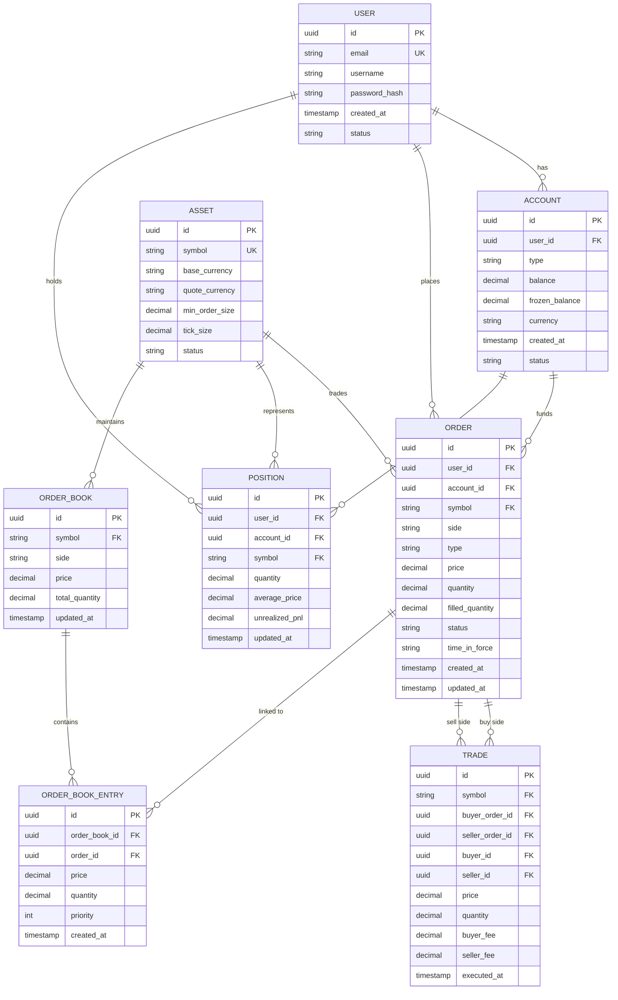

# ER Diagram

## Indexes

### USER
- `idx_user_email` UNIQUE on email
- `idx_user_username` on username

### ACCOUNT
- `idx_account_user_id` on user_id
- `idx_account_user_currency` on (user_id, currency) UNIQUE

### ORDER
- `idx_order_user_id` on user_id
- `idx_order_symbol_status` on (symbol, status)
- `idx_order_account_id` on account_id
- `idx_order_created_at` on created_at

### TRADE
- `idx_trade_symbol` on symbol
- `idx_trade_executed_at` on executed_at
- `idx_trade_buyer` on buyer_id
- `idx_trade_seller` on seller_id

### POSITION
- `idx_position_user_symbol` on (user_id, symbol) UNIQUE
- `idx_position_account` on account_id

### ORDER_BOOK
- `idx_orderbook_symbol_side` on (symbol, side)

### ORDER_BOOK_ENTRY
- `idx_obentry_book_id` on order_book_id
- `idx_obentry_order_id` on order_id
