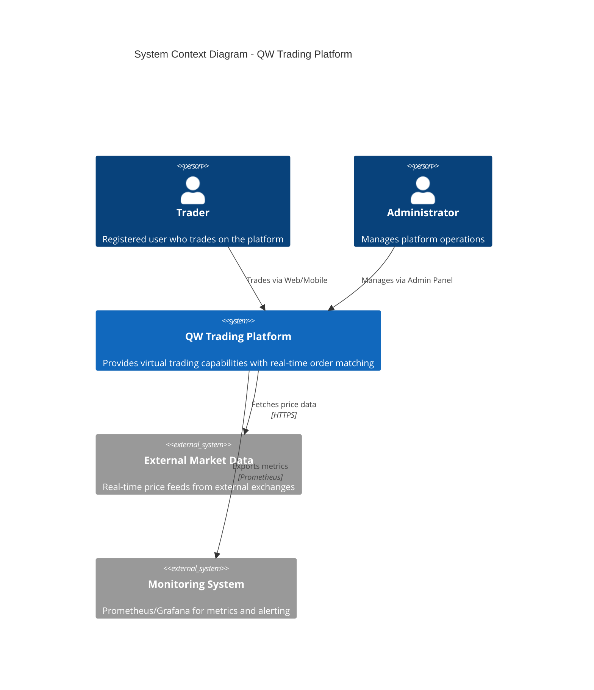
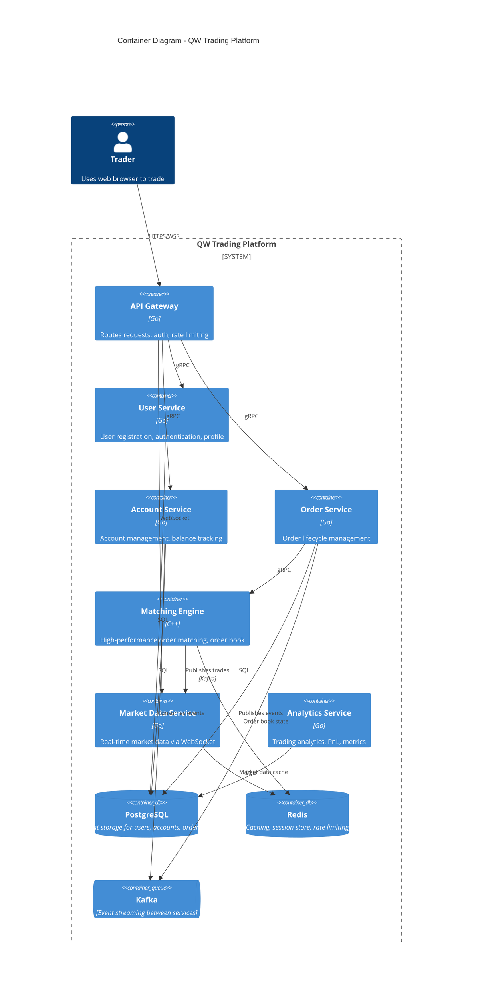
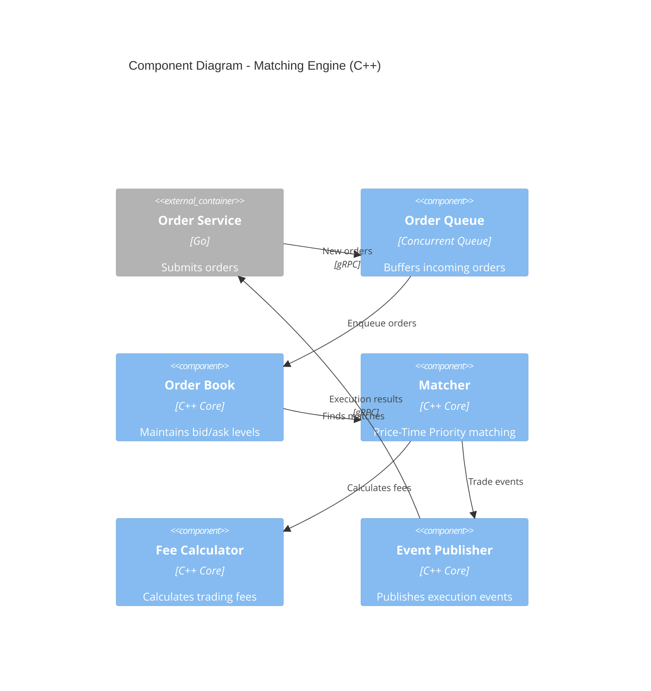
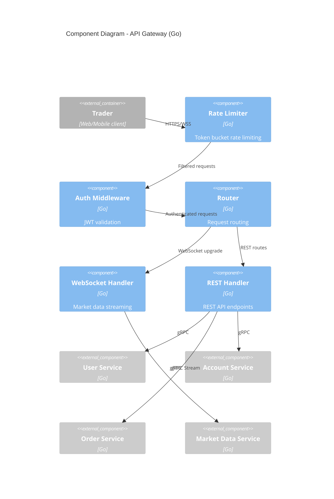
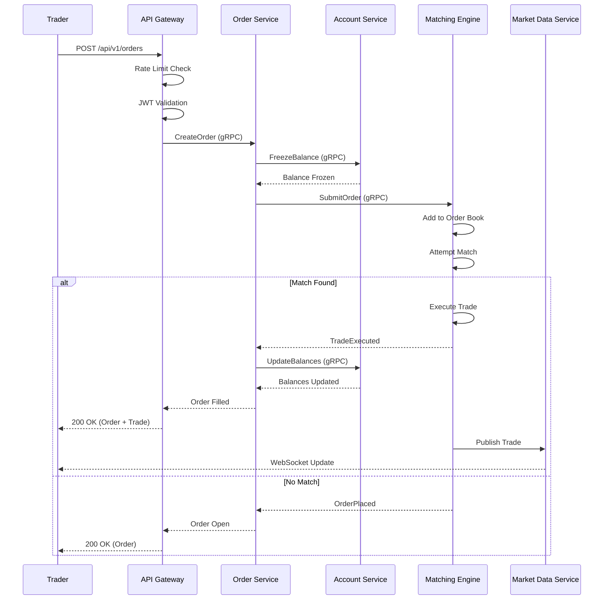
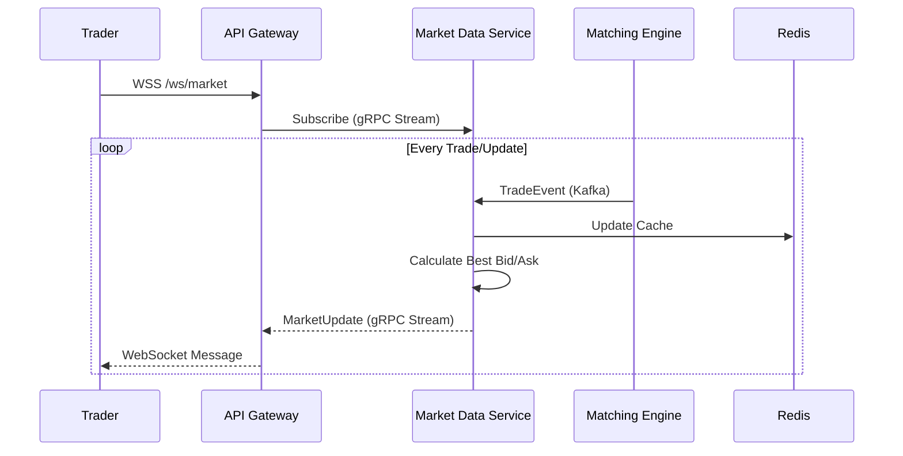

# C4 Architecture Diagrams

## Context Diagram (Level 1)

## Container Diagram (Level 2)

## Component Diagram - Matching Engine

## Component Diagram - API Gateway

## Sequence Diagram - Order Placement Flow

## Sequence Diagram - Market Data Flow

