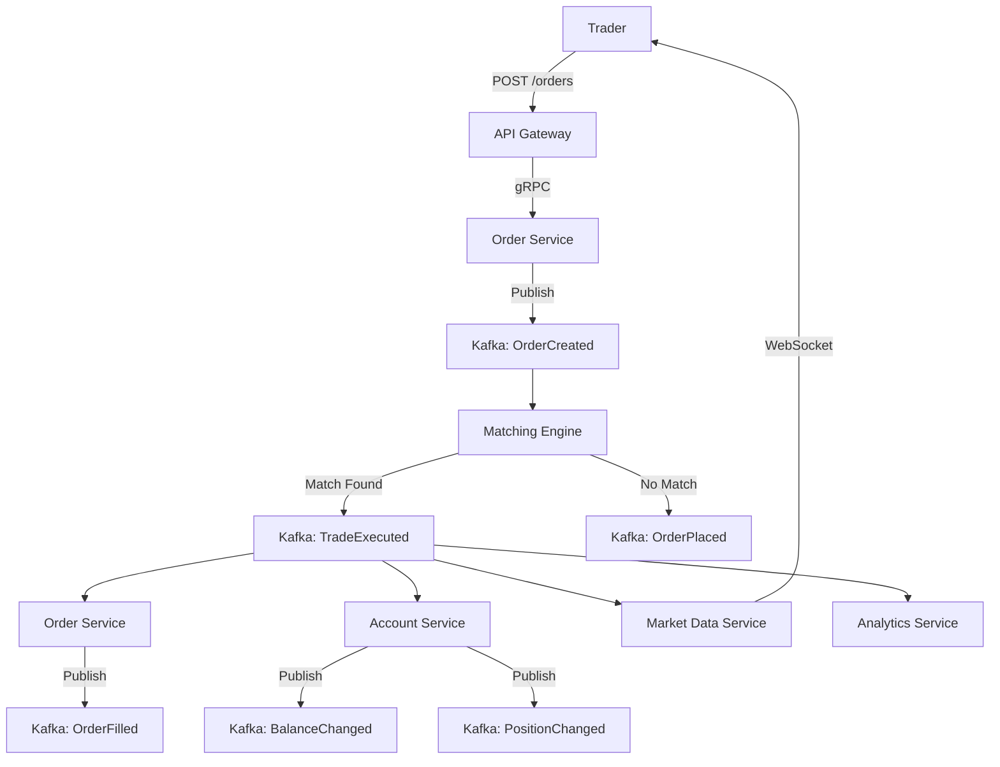
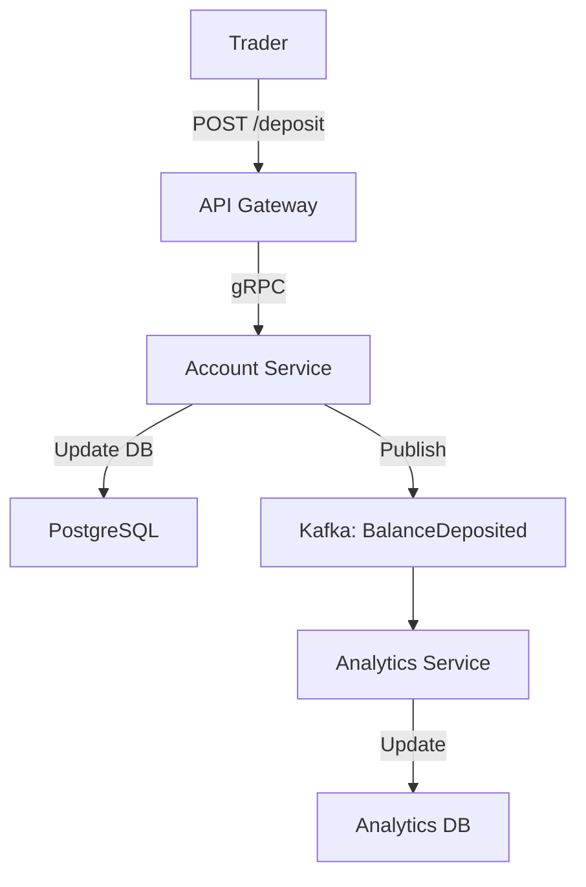

# Event Flow Diagram

## Event Types

### Domain Events

| Event | Producer | Consumer | Description |
|-------|----------|----------|-------------|
| UserRegistered | User Service | Account Service | Creates default account |
| AccountCreated | Account Service | - | Account initialized |
| BalanceDeposited | Account Service | Analytics Service | Funds added |
| BalanceWithdrawn | Account Service | Analytics Service | Funds removed |
| BalanceFrozen | Account Service | Order Service | Funds reserved for order |
| BalanceUnfrozen | Account Service | Order Service | Funds released |
| OrderCreated | Order Service | Matching Engine | New order to match |
| OrderCancelled | Order Service | Matching Engine | Cancel order |
| OrderFilled | Matching Engine | Order Service, Account Service | Full execution |
| OrderPartiallyFilled | Matching Engine | Order Service, Account Service | Partial execution |
| TradeExecuted | Matching Engine | Market Data Service, Analytics Service | Trade completed |
| PositionUpdated | Account Service | Analytics Service | Position changed |

## Event Flow - Order Lifecycle



## Event Flow - Account Operations



## Event Schema

### OrderCreated
```json
{
  "event_id": "uuid",
  "event_type": "OrderCreated",
  "timestamp": "2024-01-01T00:00:00Z",
  "data": {
    "order_id": "uuid",
    "user_id": "uuid",
    "account_id": "uuid",
    "symbol": "BTC/USDT",
    "side": "BUY",
    "type": "LIMIT",
    "price": "50000.00",
    "quantity": "0.1",
    "time_in_force": "GTC"
  }
}
```

### TradeExecuted
```json
{
  "event_id": "uuid",
  "event_type": "TradeExecuted",
  "timestamp": "2024-01-01T00:00:00Z",
  "data": {
    "trade_id": "uuid",
    "symbol": "BTC/USDT",
    "buyer_order_id": "uuid",
    "seller_order_id": "uuid",
    "buyer_id": "uuid",
    "seller_id": "uuid",
    "price": "50000.00",
    "quantity": "0.1",
    "buyer_fee": "5.00",
    "seller_fee": "5.00"
  }
}
```

### BalanceChanged
```json
{
  "event_id": "uuid",
  "event_type": "BalanceChanged",
  "timestamp": "2024-01-01T00:00:00Z",
  "data": {
    "account_id": "uuid",
    "user_id": "uuid",
    "currency": "USDT",
    "previous_balance": "10000.00",
    "new_balance": "9500.00",
    "change_amount": "-500.00",
    "reason": "ORDER_FROZEN"
  }
}
```

### PositionChanged
```json
{
  "event_id": "uuid",
  "event_type": "PositionChanged",
  "timestamp": "2024-01-01T00:00:00Z",
  "data": {
    "position_id": "uuid",
    "user_id": "uuid",
    "symbol": "BTC/USDT",
    "previous_quantity": "0.00",
    "new_quantity": "0.10",
    "average_price": "50000.00",
    "unrealized_pnl": "0.00"
  }
}
```

## Event Delivery Guarantees

1. **At-least-once delivery**: Events may be delivered multiple times
2. **Idempotent processing**: Consumers must handle duplicate events
3. **Ordering**: Events within a partition are ordered by timestamp
4. **Retention**: Events retained for 7 days
5. **Dead letter queue**: Failed events routed to DLQ after 3 retries

## Consumer Group Strategy

| Service | Consumer Group | Topics |
|---------|---------------|--------|
| Order Service | order-service-cg | OrderCreated, TradeExecuted |
| Account Service | account-service-cg | OrderCreated, TradeExecuted |
| Market Data Service | market-data-cg | TradeExecuted |
| Analytics Service | analytics-cg | TradeExecuted, BalanceChanged |
